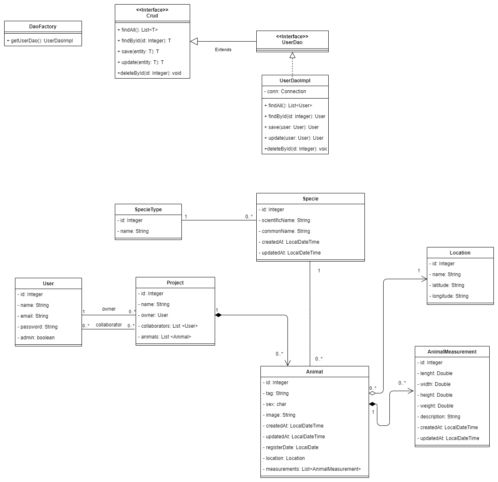

# Projeto Monfauna API

Link para o projeto com Spring: https://github.com/Shoku89/MonfaunaSpring

### Pre-requisitos

```
- JDK 11
- Wildfly
- MySQL 5.7
- IDE IntelliJ ou de sua preferência
- Postman
```
###Configurando Banco de Dados

`/sql/criar_tabelasV2.sql`

### Arquitetura do projeto


### DER


### UML




